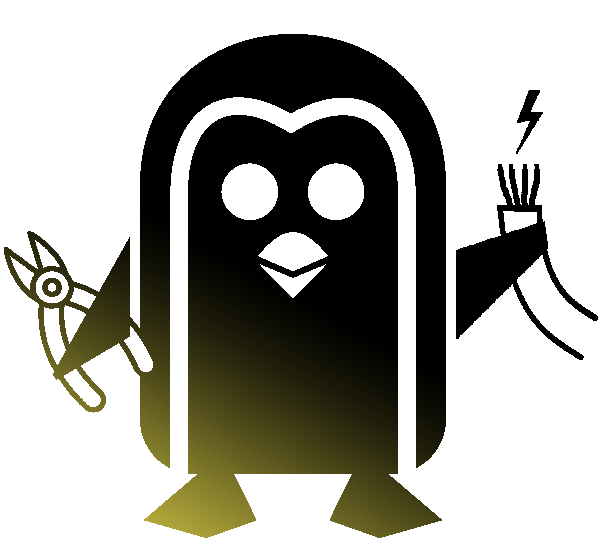

 

  

  <h1 align="center">Roger Skyline 2</h1>

  

	An automated infrastructure deployment.
     
    <a href="https://github.com/Ant0wan/Roger-skyline-2"><strong>View Demo »</strong></a>
     
    <a href="https://github.com/Ant0wan/Roger-skyline-2/issues">Report Bug</a>
    ·
    <a href="https://github.com/Ant0wan/Roger-skyline-2/issues">Request Feature</a>
  

[![Contributors][contributors-shield]][contributors-url]  

## Table of Contents

* [About the Project](#about-the-project)
* [Getting Started](#getting-started)
  * [Prerequisites](#prerequisites)
  * [Installation](#installation)
* [Usage](#usage)
* [Roadmap](#roadmap)
* [Contact](#contact)

## About The Project

## Getting Started

### Prerequisites

### Installation

## Usage

## Roadmap

See the [open issues](https://github.com/Ant0wan/Roger-skyline-2/issues) for a list of proposed features (and known issues).

## Contact

* [abarthel](https://github.com/Ant0wan)

[contributors-shield]: https://img.shields.io/github/contributors/Ant0wan/Roger-skyline-2.svg?style=flat-square
[contributors-url]: https://github.com/Ant0wan/Roger-skyline-2/graphs/contributors
